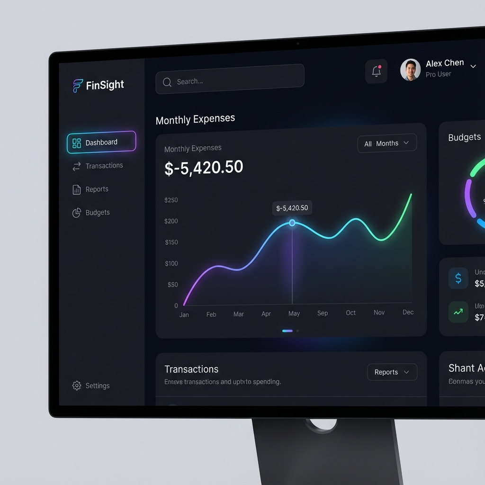
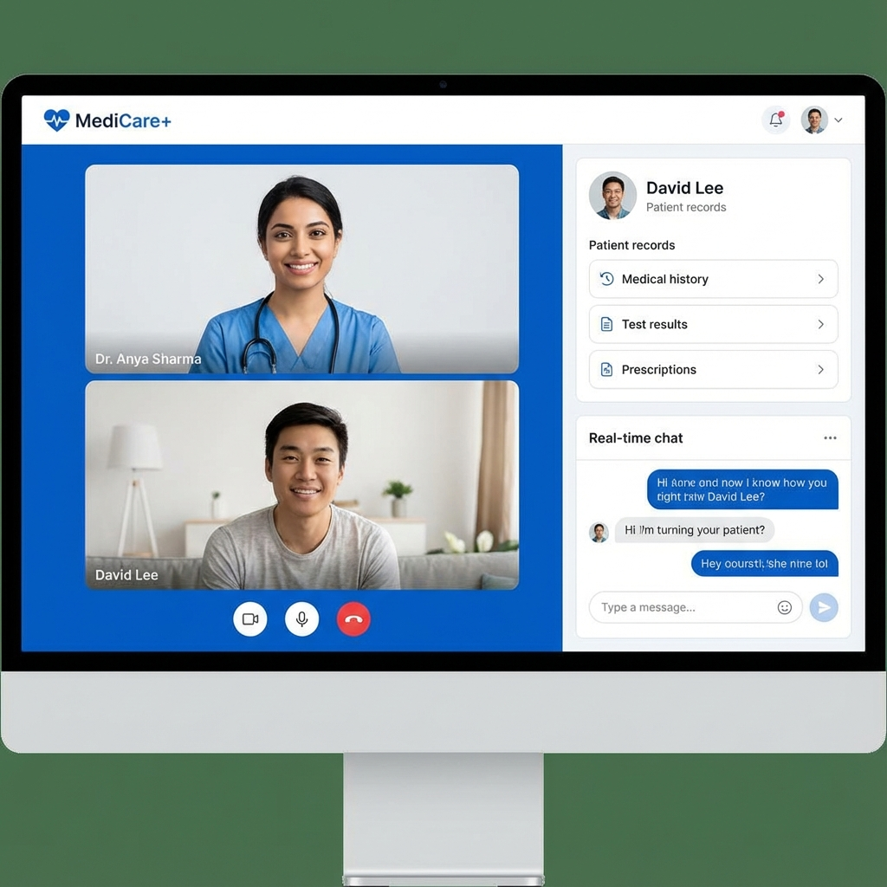
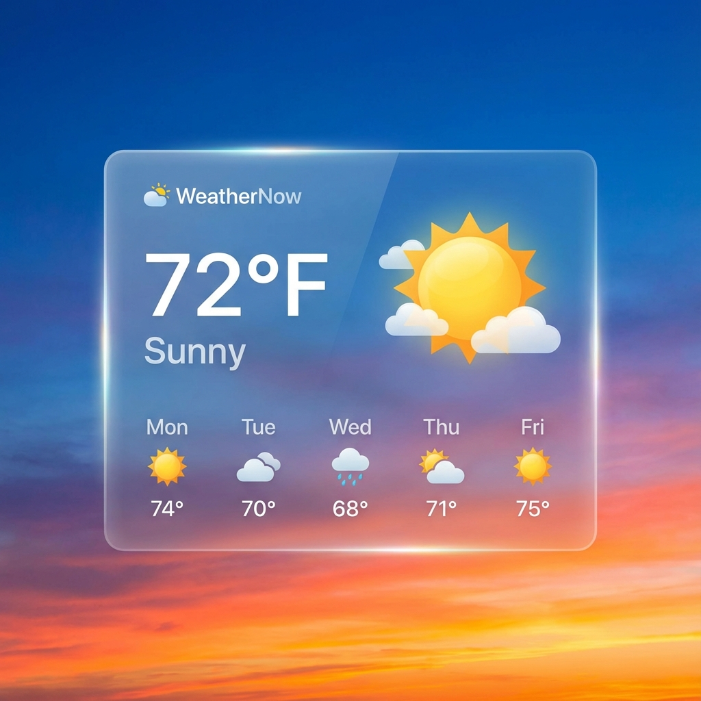
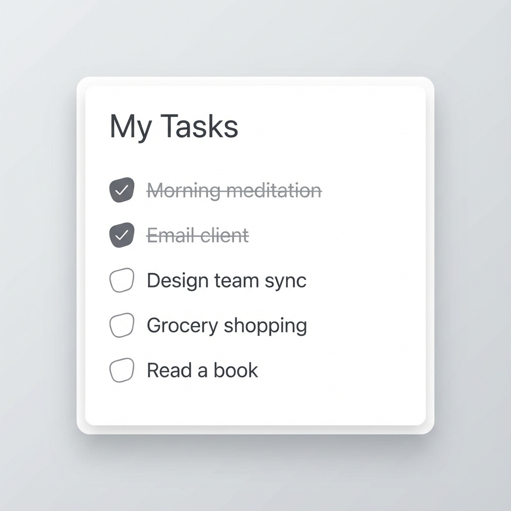

<div align="center">

# ⚡ Adaptive Portfolio V2



### A Premium, Interactive Developer Portfolio Journey

[]([https://portfolio-1adr6wvto-uarunbabya1234-gmailcoms-projects.vercel.app/](https://portfolio-git-main-uarunbabya1234-gmailcoms-projects.vercel.app?_vercel_share=LAew1uqDLeQeOuPmQNFl2KgToLwhsdF6))
[](https://react.dev/)
[](https://www.typescriptlang.org/)
[](https://tailwindcss.com/)
[](https://vitejs.dev/)

</div>

---

## � Table of Contents

- [Overview](#-overview)
- [Key Features](#-key-features)
- [Project Showcase](#-project-showcase)
- [Tech Stack](#-%EF%B8%8F-tech-stack)
- [Installation & Setup](#-%EF%B8%8F-installation--setup)
- [Deployment](#-deployment)
- [Contact](#-contact)

---

## 🚀 Overview

Welcome to my **Professional Portfolio**. This isn't just a static site; it's an immersive experience designed to showcase my technical prowess and creative design skills. Built with **React 19** and **TypeScript**, it features a fully custom **Glassmorphism** UI, dynamic scroll animations, and a real-time email system.

The goal? To demonstrate that I can build production-grade, high-performance web applications that look stunning on any device.

---

## ✨ Key Features

### 🎨 Visuals & UX
*   **Glassmorphism Design:** Modern, frosted-glass aesthetics using heavy backdrop blurring and semi-transparent layers.
*   **Scroll Spy Navigation:** The header automatically highlights the active section as you scroll.
*   **3D Tilt Effects:** Interactive cards that respond to mouse movement (Hero & Project sections).
*   **Custom Cursors & Animations:** Smooth transitions powered by CSS variables and keyframes.

### 🛠️ Functionality
*   **Draggable Floating Button:** A unique "Home" button that you can drag anywhere on the screen.
*   **Functional Contact Form:** Integrated with **EmailJS** to send messages directly to my inbox without a backend server.
*   **Responsive Layout:** Flawless rendering on Mobile (iPhone/Android), Tablets (iPad), and Desktops.

---

## 📸 Project Showcase

I have built several high-impact projects highlighted in this portfolio:

| **FinSight** | **MediCare+** |
|:---:|:---:|
|  |  |
| *Smart Finance Tracker* | *Doctor Consultation Platform* |

| **WeatherNow** | **To-Do List** |
|:---:|:---:|
|  |  |
| *Live Weather Forecast* | *Persistent Task Manager* |

---

## 🛠️ Tech Stack

### Core
*   **Frontend:** [React 19](https://react.dev/) + [TypeScript](https://www.typescriptlang.org/)
*   **Styling:** [Tailwind CSS v3.4](https://tailwindcss.com/)
*   **Build Tool:** [Vite](https://vitejs.dev/)

### Libraries & Tools
*   **Email:** `@emailjs/browser` (For contact form)
*   **Icons:** `lucide-react` (SVG Icons)
*   **Linting:** ESLint + Prettier

---

## ⚙️ Installation & Setup

Want to run this locally? Follow these steps:

### 1. Clone the Repo
```bash
git clone https://github.com/U-ARUN07/portfolio.git
cd portfolio
```

### 2. Install Dependencies
```bash
npm install
```

### 3. Setup Environment Variables
Create a `.env` file in the root directory and add your EmailJS keys:
```env
VITE_EMAILJS_SERVICE_ID=your_service_id
VITE_EMAILJS_TEMPLATE_ID=your_template_id
VITE_EMAILJS_PUBLIC_KEY=your_public_key
```

### 4. Start Development Server
```bash
npm run dev
```

---

## 🌍 Deployment

This project is optimized for deployment on **Vercel** or **Netlify**.

### Vercel (Recommended)
1.  Push code to GitHub.
2.  Import repository on Vercel.
3.  **IMPORTANT:** Add the Environment Variables in the Vercel Dashboard.
4.  Deploy!

---

## 🤝 Contact

I'm currently **Open for Work** (Internships/Full-time). feel free to reach out!

<div align="center">

[](mailto:u.arunbabya1234@gmail.com)
[](https://www.linkedin.com/in/u-arun-9956a5297/)
[](https://github.com/U-ARUN07)

</div>

<div align="center">
  <sub>Built with ❤️ by Arun</sub>
</div>
